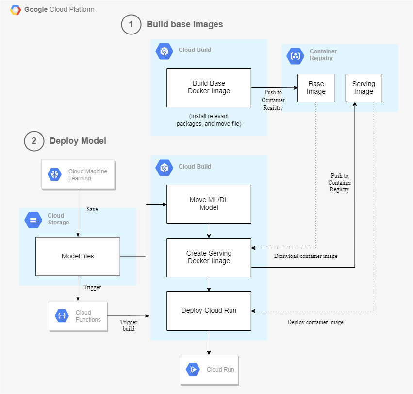

# Deploy a ML Service With Cloud Build

## Architecture

## Required IAM permissions
### Grant the Cloud Run Admin role to the Cloud Build service account
    1. Go to the Cloud Build Settings page
    
    2. Locate the row with the Cloud Run Admin role and set its Status to ENABLED.

### 讓 Cloud Build 服務帳戶可間接取用 Cloud Run runtime (comput engine) 服務帳戶可取用的資源

授予其 Service Account User 的角色，使 cloud build 帳戶可模擬成 compute engine 帳戶

    1. Go to the Service Accounts page

    2. select [PROJECT_NUMBER]-compute@developer.gserviceaccount.com. This is the Cloud Run runtime service account.

    3. Click SHOW INFO PANEL in the top right corner, and then click the Add Member button.

    4. Enter the email address of the Cloud Build service account. ([PROJECT_NUMBER]@cloudbuild.gserviceaccount.com)

    5. Select Service Account User.

## Airflow Operator 使用
1. 需給予 source 位置，若位置在 GCS 則需將所需要的檔案 (e.g. Dockerfile) 壓縮成 tag.gz